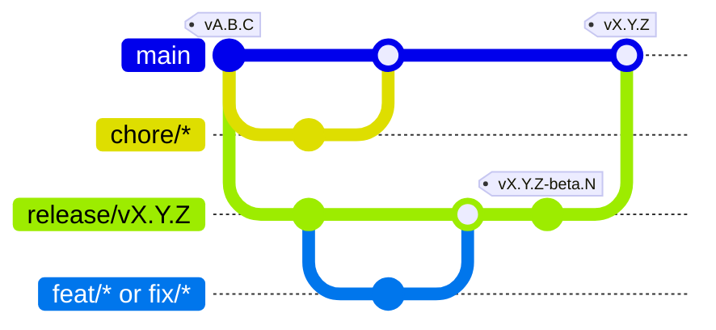

# Contributing

Thank you for your interest in contributing to Adaptive Tab Bar Colour (ATBC)!

## Sponsor

You can sponsor the project via:

<a href="https://www.paypal.com/donate?hosted_button_id=T5GL8WC7SVLLC" target="_blank">
	
</a>
<a href="https://www.buymeacoffee.com/easonwong" target="_blank">
	
</a>

## Translation

Community translations make ATBC accessible to everyone.

New UI strings often start out machine-translated. If you spot any awkward phrasing or want to add a new language, please feel free to open a pull request.

### UI Text

Text for the popup and options page is in [`src/locales/xx.yaml`](../src/locales). You can edit these files using the [i18n Ally](https://marketplace.visualstudio.com/items?itemName=Lokalise.i18n-ally) extension.

Strings that wrap around dynamic content, such as selectors or code tags, are split into two keys:

- `<key>`: Text before the item.
- `<key>End`: Text after the item.

For example:

```yaml
couldNotFindElement: "Could not find the HTML element matching "
couldNotFindElementEnd: ", using colour picked from the web page instead"
```

Rendered result:

> Could not find the HTML element matching `header`, using colour picked from the web page instead

> [!TIP]
> Set `<key>End` to `"\0"` if your language does not require text after the item.

### Store Description

When adding a new language, provide a translated store description in [`amo/amo-xx.md`](../amo). These files update the listing on Mozilla Add-ons and the “Details” tab in Firefox. You can also edit existing descriptions there.

## Development

Ensure the following software is installed:

- [Node.js](https://nodejs.org/) (v20 or higher)
- [Firefox](https://www.firefox.com/) or [Firefox Developer Edition](https://www.mozilla.org/firefox/developer/)

To set up the project locally:

```bash
git clone https://github.com/atbc-org/Adaptive-Tab-Bar-Colour.git
cd Adaptive-Tab-Bar-Colour
npm install
```

Run `npm start` to test changes in Firefox, or `npm run start:dev` for Firefox Developer Edition. This builds and launches the add-on in the browser.

## Release Workflow (Maintainer)

`main` always reflects the current production release. New work and stabilisation happen on dedicated `release/vX.Y.Z` branches.



1. **Features & Fixes**: Branch from and open PRs against the active `release/vX.Y.Z`. PRs are merged once integration tests pass.
2. **Beta Releases**: The `Release Beta` workflow runs on `release/**` branches to deploy test builds (`X.Y.Z.1`, `X.Y.Z.2`...) to AMO (unlisted) and tag GitHub pre-releases (`vX.Y.Z-beta.N`).
3. **Production Releases**: Open a PR from `release/vX.Y.Z` to `main`. The PR body serves as release notes. Merging into `main` automatically triggers `Release Production`, which uploads to AMO (listed), tags `vX.Y.Z`, creates the GitHub Release, and deletes the release branch.
4. **Chores**: Maintenance branches (`chore/*`, Dependabot updates, documentation) branch from and merge directly into `main`.
