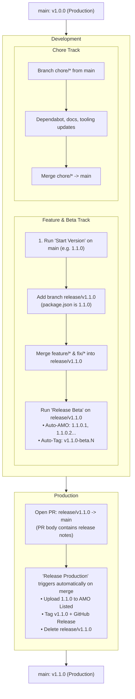

# Contributing

Thank you for your interest in contributing to Adaptive Tab Bar Colour!

## Sponsor

One way to contribute to the project is through sponsorship via:

<a href="https://www.paypal.com/donate?hosted_button_id=T5GL8WC7SVLLC" target="_blank">
	
</a>
<a href="https://www.buymeacoffee.com/easonwong" target="_blank">
	
</a>

## Translation

To fix translation errors or add a new locale, please update the following files:

- `src/locales/xx.yaml`: The text in the add-on’s popup and options page.
- `amo/amo-xx.md`: The add-on description on the Mozilla Add-on store and the “Details” section in Firefox’s Add-ons Manager.

You can work on the locales using the [i18n Ally](https://marketplace.visualstudio.com/items?itemName=Lokalise.i18n-ally) extension.

## Development

Ensure the following software is installed:

- [Node.js](https://nodejs.org/) (v20 or higher)
- [Firefox](https://www.firefox.com/) or [Firefox Developer Edition](https://www.mozilla.org/firefox/developer/)

To begin contributing, run the following commands:

```bash
git clone https://github.com/atbc-org/Adaptive-Tab-Bar-Colour.git
cd Adaptive-Tab-Bar-Colour
npm install
```

To test the changes with Firefox, run `npm start`. Alternatively, run `npm run start:dev` to test with Firefox Developer Edition. The add-on will be built and launch in the browser.

## Release Workflow

`main` always reflects the current production release. New work and stabilisation happen on dedicated `release/vX.Y.Z` branches.



### Workflow Rules

1. **Features & Fixes**: Branch from and open PRs targeting the active `release/vX.Y.Z`. PRs merge once integration tests pass.
2. **Beta Testing**: The `Release Beta` workflow runs on `release/**` branches to deploy test builds (`X.Y.Z.1`, `X.Y.Z.2`...) to AMO (unlisted) and tag GitHub pre-releases (`vX.Y.Z-beta.N`).
3. **Production Releases**: Open a PR from `release/vX.Y.Z` to `main`. The PR body serves as release notes. Merging into `main` automatically triggers `Release Production`, which uploads to AMO (listed), tags `vX.Y.Z`, creates the GitHub Release, and deletes the release branch.
4. **Chores**: Maintenance branches (`chore/*`, Dependabot updates, documentation) branch from and merge directly into `main`.
